# border属性的特点以及实际的应用场景

border属性是在实际的应用中使用频率比较高的一个属性。利用border属性的一些特征以及表现方式，可以在实现一些比较常见的效果（如等高布局，上下固定内容滚动布局），利用css3新增的属性值（如使用图片填充边框）可以实现一些更复杂的效果。

### 一、border的特点
1. border中的`border-style`可选值为 `solid(实线)`， `dotted(点)` `dashed(虚线)`， `double(双线)`,此外还有`inset`, `outset`, `groove`, `ridge`等3D效果的边框，目前在实际项目中，用的比较多的是`solid`和`dashed`。

2. border中的`border-width`的值可以是`thin`,`medium`,`thick`以及数值如（2px）,浏览器的默认值是medium，用js获取这个值时是3px。但是border属性值不支持百分比数值。

3. border中`border-color`支持的值也是颜色名称（如red），十六进制值（如#F00），rbg/rgba（如rgb(255,0,0)）和`transparent`。如果不指定颜色，将会以当前元素的文字颜色值作为默认值。

### 二、border的应用

1. 利用border画三角形和梯形等
在CSS中，没有哪个属性是可以将一个元素修饰为三角形。但是，我们利用border在渲染时的一些表现特点可以画出三角形，梯形等。以下讲解如何一步一步得到三角形。
首先我们定义一个div，样式如下

	```css
	 .border {
	 	width: 200px;
	 	height:100px;
	 	margin:0 auto;
	 	border-top:40px solid red;
	 	border-bottom:40px solid green;
	 	border-left: 40px solid yellow;
	 	border-right: 40px solid blue;
	 }
	```

	浏览器渲染后效果如下：

	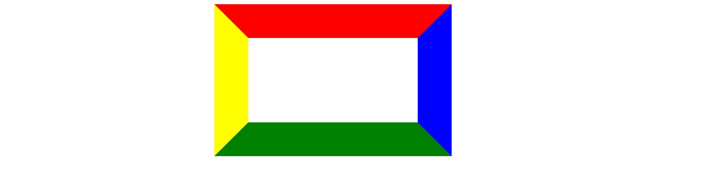

	我们发现，通过定义给div的四个边框定义不同的颜色，我们发现其渲染后的表现形式为四个梯形组成的边框。
	如果我们把高度定义为0，那么渲染后如下：

	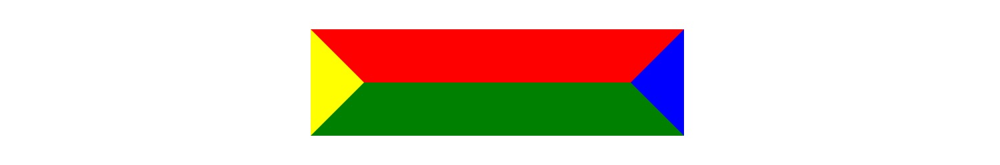

	如果我们再把宽度定义为0，结果如下：

	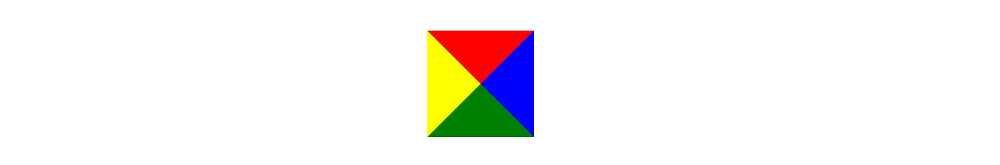

	通过对比以上定义的不同的样式，我们发现，在CSS中，边框的表现实际上以梯形的形式来渲染的（这可能与`groove`等3D效果的属性值有关）。当元素的宽高为0时就会变成挤在一起的四个三角形。因此，我们可以想到，如果把其中的三个边框的颜色定义为透明色`transparent`,。然后通过包裹在一个外层容器上，并给外层容器设置overflow:hidden，那么我们将得到一个等腰梯形或者三角形。现在我们把css修改为以下内容。


	```css
	 .trapezoid {
	 	width: 200px;
	 	height:0;
	 	border-top:none;
	 	border-bottom:60px solid #249ff1;
	 	border-left: 40px solid transparent;
	 	border-right: 40px solid transparen;
	 }
	```
	我们将得到以下梯形：

	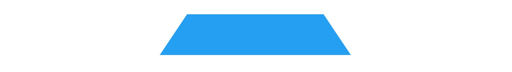

	将样式设置为如下：

	```css
	 .triangle {
	 	width:0;
	 	height:0;
	 	border-top:0 solid transparent;
	 	border-bottom:100px solid #249ff1;
	 	border-left: 100px solid transparent;
	 	border-right: 100px solid transparent;
	 }
	```
	我们将得到以下三角形：

	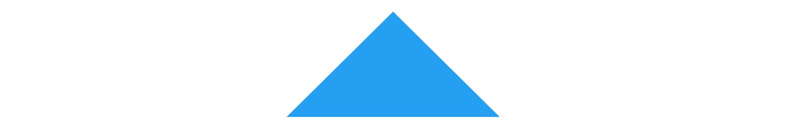

	以上完整的代码请[点击此处查看](./demos/border/simple.html)

	有了这种表现形式的基础，我们可以通过设置不同边框宽度值、颜色以及借住伪元素或者多个元素的拼接可以实现更为复杂的一些图形，比如多角星，菱形，多边形以及我们常见的聊天气泡等。如下为其中几个例子[你可以点击此处查看源代码](./demos/border/more.html)。

	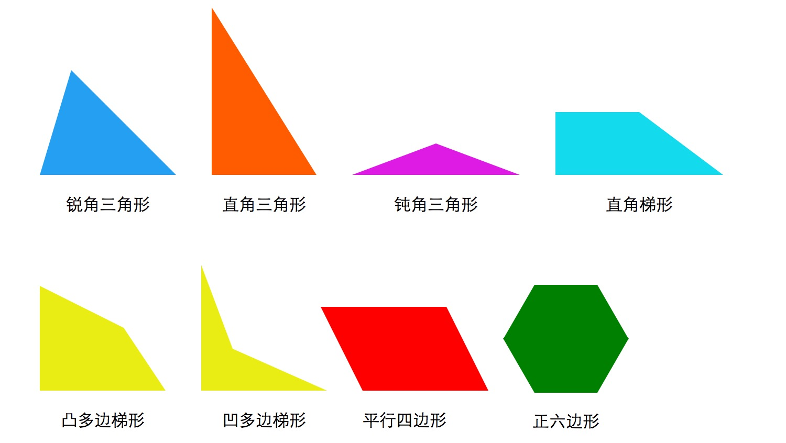

2. 利用border实现左右两栏等高布局
	在实际上项目中，我经常会有左右两栏布局的需求，比如后台管理的左侧菜单栏区域和右侧的内容区域以及类似京东分类导航的布局，如下图。

	

	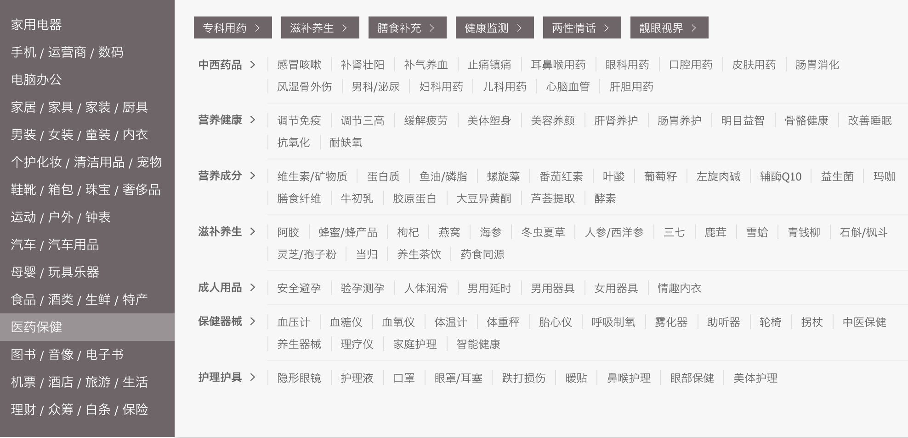

	实现这种布局有很多解决方案，比如利用padding和margin相互抵消的方法即可实现。但是如果利用border来实现的话，可能可以使CSS更加简洁。比如针对第一张图的效果，我们定义如下html结构。

	```html
	<div class="menu">
		<ul>
			<li>首页</li>
			<li>商品管理</li>
			<li>营销中心</li>
			<li>会员管理</li>
			<li>系统设置</li>
		</ul>
	</div>
	<div class="content">这里是内容区域</div>
	```

   以及以下主要的CSS：

	```css
	.menu {
		float: left;
		width: 200px;
		color:  #FFF;
	}
	.content {
		border-left:  200px solid #40403b;/*这里是主要的样式*/
		padding: 20px;
		height: 1000px; /* 这里代表内容区域 */
	}
	```

  通过以上的样式定义和html结构定义就可以实现，[完整的源码请点击这里查看](./demos/border/layout1.html)

  > ***由于border宽度不支持百分比值，所以这种实现方法的缺点是难以直接做到自适应。***

3. 利用border实现上下固定布局

	尤其是在移动端上的应用，页面的头部和底部固定，中间内容区域滚动是常见的布局，如下图。
	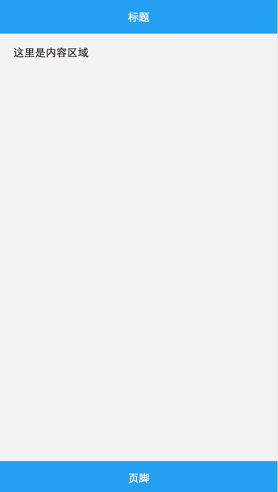

	实现这种布局同样是有种实现方法，比如利用上下fixed定位，中间absolute定位和overflow-y:scroll。但是如果利用border来实现不仅代码简洁，兼容性也高。其核心的样式为在内容区域增加透明的上下边框，上边框的宽度等于头部高度，下边框的宽度等于脚步高度。如下：

	```css
	header,footer {
		position: fixed;
		width: 100%;
		line-height: 50px;
		color: #FFF;
		background: #249ff1;
		text-align: center;
	}
	header {
		top: 0;
		left: 0;
	}
	footer {
		bottom: 0;
		left: 0;
	}
	.container {
		padding: 20px;
		background: #f3f3f3;
		height: 1000px; /*这里代表内容*/
		border-top: 50px solid transparent;/*上边框宽度等于header高度*/
		border-bottom: 50px solid transparent;/*下边框宽度等于footer高度*/
	}
	```

	> 利用这种方法，我们同样也可以实现背景的定位，比如为图片添加水印时水印的右下角和左上角等定位。

4. border-color使用技巧


	由于在border不指定颜色时其颜色值等于标签的字体颜色值，我们可以利用此特点做一些效果。比如：具有边框的a标签，正常状态下边框和字体颜色为灰色，鼠标经过时为蓝色，如下：

	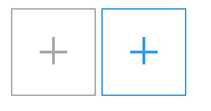

	一般情况下，我们会用伪元素来写里面的加号，当鼠标经过时要同时改变边框色值，字体色值和伪元素的背景色值，但是利用这属性，我们只需要改变a标签的字体色值。代码如下。

	```css
	a {
		position: relative;
		display: inline-block;
		padding: 30px 20px;
		color: #a7a7a7;
		border: 1px solid;
	}
	a:hover {
		color: #249ff1;
	}
	a:before,a:after {
		content: '';
		display: block;
	}
	a:after {
		border-top: 2px solid;
		width: 20px;
	}
	a:before {
		position: absolute;
		top:  20px;
		left:  29px;
		border-left: 2px solid;
		height: 20px;
	}
	```

5.  自适应三角形

	有时候我们会有做自适应三角形效果的需求，比如下图。这是一个注册页面，设计需求为：在注册页面顶部的两个身份的选择为两个灰色背景的矩形，宽度自适应。当选中其中一个身份时变为蓝色背景的五边形。

	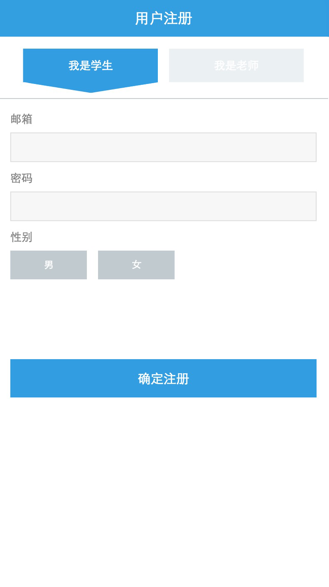

	我们对设计进行拆分，很自然的是把激活状态下的形状拆分为顶部的矩形和底部的等腰三角形。这样可以借助伪元素以及边框画三角形的方法进行CSS样式的定义。但问题来了，因为两个标签的宽度是自适应的，那么边框宽度的值也需要自适应，然而边框的宽度值是不支持百分比的。？？怎么办？这时我们第一个想到的方法自然会是用js动态计算，但是不是不借助js动态计算就没有办法了呢？我们可以画个图进行分析。

	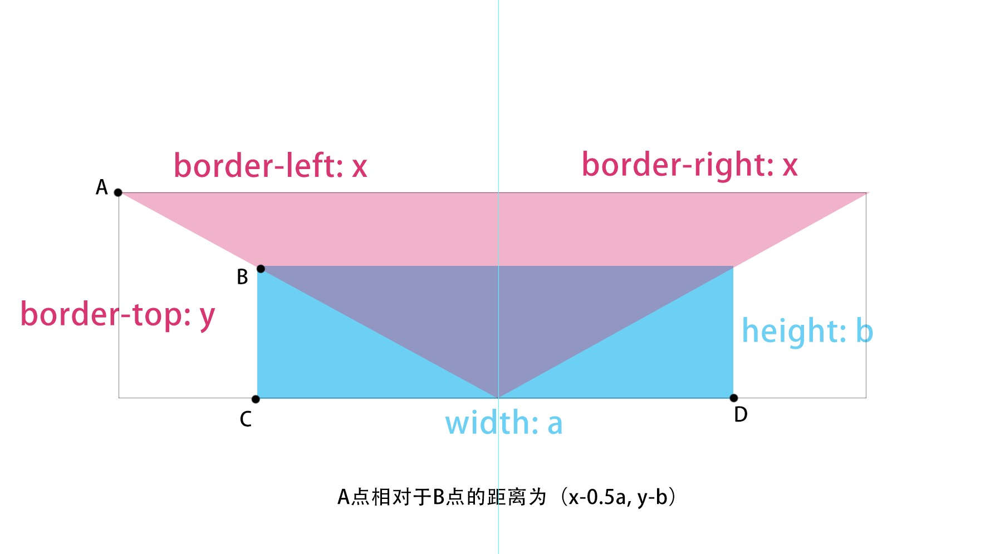

	当我们要让三角形随着矩形自适应时，在父级标签（蓝色部分）下，其理想状态应该为图中交叉部分(上边框+透明的左右边框)。由于不支持百分比，我们姑且给边框宽度都给一个很大的值，通过定位后，就成了图中红色三角形的部分。溢出的部分，我们在父级进行overflow:hidden即可，这样一个自适应的三角形就实现了。我们假设父级的宽度为a,高度为b,三角形的border-top为y，border-left和border-right为x。在未进行定位之前，A点应该与B点重合，通过定位后，A点与B点相对位置为(-(x-0.5a） , -(y-b)）。此时我们又遇到一个问题，就是x和y为一个固定的大值，a和b为一个百分比值，那么css就要进行计算，用css的calc属性可以解决，但是可能会有兼容性问题。我们通过思考，换个角度，如果能够让A点相对于C和D的中点定位，那相对位置就变为(-x,-y)，问题就好办了。我们把图片做一下改变，如下图：

	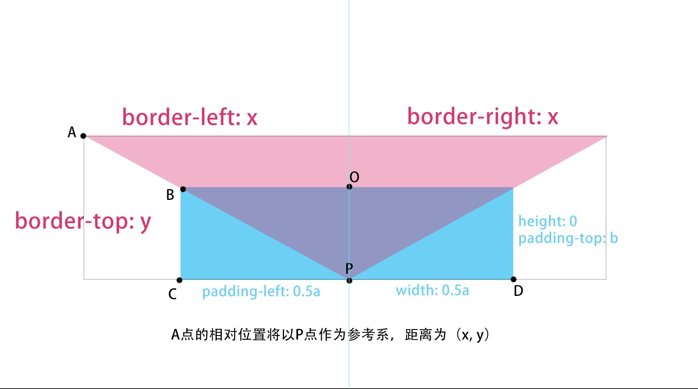

	如果我们把父级的高度设置为0,利用padding-top来撑开高度，把宽度设置为0.5a，利用padding-left来撑开另外的0.5a，那么A点就相对于P点定位了。此时，A相对于P的位置为(-x,-y)。那么通过以下样式即可实现一个响应式三角形。**(注意border-left和border-top的比例，根据相似三角形即可)**

	html:

	```html
	<div></div>
	```

	css:

	```css
	div {
	    width: 40%;
	    padding-top: 8%;
	    padding-left: 40%;/*宽高比为10:1*/
	    overflow: hidden;
	    border: 1px solid red;/*为方便观察显示*/
	}
	div:after {
		content:  '';
		display: block;
		width: 0;
		height: 0;
		border-top: 300px solid #249ff1;/*宽高比为10:1，即（1500+1500）: 300*/
		border-left: 1500px solid transparent;
		border-right: 1500px solid transparent;
		margin-top: -300px;
		margin-left: -1500px;
	}
	```
	 效果如下：

	 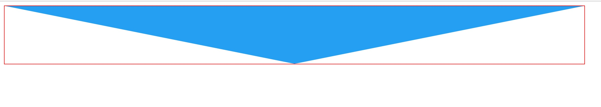

	 有了这个方法，就可以实现上面的注册页的设计。同时通过调整各个参数，一样可以实现各种类型的三角形。设要定义的等腰三角形底为2x,高为y，父级需要的宽为2a,高为b。那么各个值满足的关系如下：

	 ```
	 border-left = border-right = x = -margin-left;
	 border-top / padding-top = x / a;
	 margin-top = -border-top;
	 至于border-left的取值则根据实际需要设置一个大值即可，而border-top与三角形的形状有关，即与a和b比例有关。
	 ```

	**以上为border属性的一些特点和实际应用，后期将会继续更新更多的特点和使用场景。暂且先写这些。**


